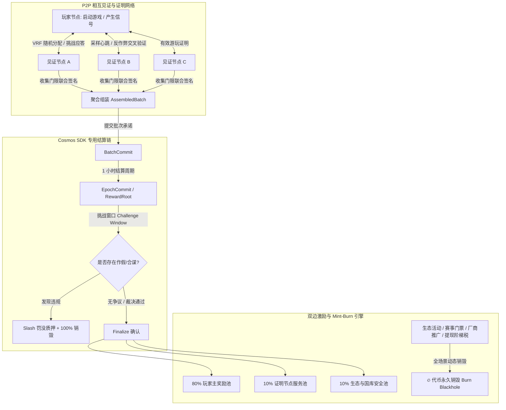

# PoLE (Proof of Live Engagement) 项目规划计划书
## —— 基于去中心化相互见证、双边激励与动态活动销毁的游戏价值网络

---

### 文档概览
- **项目代号**：PoLE（Proof of Live Engagement / Proof of Play）
- **核心定位**：首个面向全球 PC 游戏的去中心化真实游玩证明与价值分配公链网络
- **核心叙事**：**节点相互证明防作弊（Proof of Play） + 玩游戏与做证明双边激励（Dual Rewards） + 无上限弹性增发与全场景活动销毁（Mint & Burn Equilibrium）**
- **当前技术栈基底**：Rust（高性能去中心化节点与客户端）+ Cosmos SDK / Tendermint（专用结算与验证应用链）+ Tauri / Web（跨平台桌面端控制台）

---

## 一、 项目愿景与问题定义

### 1.1 行业核心痛点
1. **传统游戏时长的价值垄断**：全球数十亿玩家每年在 PC 游戏（Steam、Epic 等）中投入数千亿小时的高强度参与，这构成了游戏产业数百亿美元估值的基石，但玩家除了游戏内虚拟资产外，无法捕获任何网络级底层价值。
2. **传统 GameFi 的“庞氏与脚本”死局**：
   - 依赖发行“新链游”，游戏性极差，生命周期仅有数周；
   - 极易被工作室多开脚本、云服务器刷量薅羊毛（Sybil 攻击）；
   - 设定固定代币硬顶，导致后期新增激励匮乏，老玩家套现离场，新玩家无动力进入。
3. **“证明玩家真实玩了游戏”的中心化信任难题**：以往依赖中心化服务器上传时长数据，存在数据篡改、黑盒作弊、单点故障和平台寻租等问题。

### 1.2 PoLE 的破局方案
PoLE 不发行劣质链游，而是**直接寄生并赋能全球现存的万亿级成熟 PC 游戏生态**。通过：
1. **P2P 去中心化相互证明**：节点之间互相打心跳、互相审计游戏行为特征、门限联合签名，在不泄露隐私的前提下确认“对方真实在玩游戏，没有作假”。
2. **双边激励机制**：玩游戏的节点贡献生态活跃度（获得玩家主奖励），做证明的节点贡献算力、网络带宽与诚信监督（获得见证服务奖励）。
3. **无上限弹性铸造 + 动态活动销毁**：取消固定总量上限，保证激励源源不断；同时引入极具深度的“活动门票、公会特权、厂商推广、阶梯提现税、违规罚没”强力销毁黑洞，让网络越繁荣，代币实际通缩越强，实现坚挺的代币经济价值。

---

## 二、 核心机制详解



### 2.1 机制一：去中心化节点相互证明与防作弊网络（Mutual Attestation）

#### 1. 节点角色定义
- **玩家节点 (Player Node)**：运行在玩家 PC 上，负责启动合法游戏进程，采集非隐私的交互抖动、前台焦点、游戏状态哈希等特征。
- **见证节点 (Witness / Verifier Node)**：由拥有稳定带宽与质押代币的节点担任，负责接收任务、发起随机挑战（Challenge-Response）、验证玩家心跳并联合签署游玩证明。
- **提议聚合节点 (Proposer Node)**：轮流负责打包全网见证收据，生成默克尔树并提交链上承诺。

#### 2. 相互证明与反作弊流程
1. **VRF 动态随机见证池**：
   - 协议每个 Epoch 通过链上随机数（VRF）为每个玩家节点动态分配一组（例如 5~7 个）独立的地理分布见证节点，彻底杜绝同 IP、局域网多开或固定节点私下串通（Anti-Collusion）。
2. **多维反挂机与防脚本信号采样**：
   - **交互熵值检测**：监测键盘、鼠标、手柄输入的微观离散度与熵值（排除机械循环按键脚本）；
   - **硬件负载与图形管线**：采集 GPU/CPU 核心渲染管线波动特征（排除仅修改进程名或假挂机）；
   - **进程上下文与内存完整性**：提取公开游戏二进制哈希与平台会话签名（Steam Ticket / Epic Auth）。
3. **P2P 异步心跳挑战（Challenge-Response）**：
   - 见证节点每隔随机间隔（如 30~90 秒）向玩家节点发送一个加密随机数 nonce 与特定校验挑战；玩家节点在规定毫秒级延迟内返回带签名与硬件状态证明的 Response。
4. **门限见证收据 (Threshold Attestation Receipt)**：
   - 玩家在该时间片内必须获得超过 $\ge 2/3$ 的见证节点签名，方可生成一条有效的 `ValidPlayProof`。
   - 见证节点将其整理为批次证据并保留在本地，提供随叫随到的可取回性（Availability）。

#### 3. 链上乐观挑战防线（Optimistic Dispute & Slash）
- 聚合节点将小时奖励根（`RewardRoot`）上链后，进入 **Challenge 窗口**（如 24 小时）。
- 任何节点如果发现：
  - 某个玩家节点篡改了时长；
  - 见证节点未实际抽样就盖章（假见证）；
  - 见证节点无法在受到审计时交出原始证据收据；
- 即可发起链上 Challenge。挑战成功后，作恶玩家及渎职见证节点的**质押金将被严厉罚没（Slash）并永久销毁**，挑战者获得部分奖励。

---

### 2.2 机制二：双边激励分配体系（Dual Rewards）

网络每个结算周期（默认 1 小时）的释放总额，严格按照职责贡献双向分配：

#### 1. 玩家主奖励池（占比 80%）—— 贡献核心生态价值
- **分配原则**：按玩家在该小时内通过相互见证认可的“有效游玩时长”与“游戏权重”的乘积按比例分账。
- **分账公式**：
  $$\text{Player\_Hour\_Weight} = \sum (\text{Effective\_Play\_Time}_i \times \text{Game\_Weight}_i)$$
  $$\text{Player\_Reward} = \text{Player\_Pool} \times \frac{\text{Player\_Hour\_Weight}}{\sum \text{Total\_Network\_Weight}}$$
- **特色**：真正玩 3A 大作或热门电竞游戏的玩家获得高权重，轻度游戏获得基础权重，纯挂机或作假者权重归零。

#### 2. 见证节点服务奖励池（占比 10%）—— 维护网络可信安全
- 见证节点不靠“玩游戏”拿奖励，而是靠“提供诚实的审计与通信服务”拿奖励。
- **考核维度**：
  - **见证吞吐量**：成功签署的有效证明数量；
  - **网络 SLA**：响应挑战的延迟与在线率；
  - **质押权重**：抵押的代币数（确保做恶成本远大于收益）；
  - **审计通过率**：在存储挑战与抽检中 100% 履约。

#### 3. 生态与治理国库（占比 10%）
- 用于主网安全储备金、重大漏洞赏金、全球社区赛事补贴及协议开源升级。

---

### 2.3 机制三：无上限弹性铸造 × 强生态活动销毁闭环（Mint & Burn Dynamic Sinks）

这是解决“代币长期价值”最关键的经济学设计。

#### 1. 为什么“奖励无上限（Uncapped Elastic Minting）”？
- **传统固定硬顶的缺陷**：比特币依靠交易费替代减半奖励耗时百年，但在应用型链中，固定总量会导致“挖完即塌缩”，后期新进玩家收益极低，生态沦为存量博弈。
- **PoLE 弹性铸造逻辑**：
  - 只要人类还在玩游戏，PoLE 就会持续奖励真实的游玩与见证。
  - 增发率与全网活跃度挂钩（Activity-adjusted Elastic Emission）：全网参与度过热时，增发率自动向下微调；参与度偏冷时，上调奖励吸引玩家回流。

#### 2. 如何保证代币价值？—— 全场景动态活动销毁矩阵（Burn Sinks）

代币的价值不取决于“总量是否有限”，而取决于**“实际燃烧消耗量与市场抛压之间的动态差额”**（$\text{Net Inflation} = \text{Emission} - \text{Burn}$）。
PoLE 通过以下 6 大支柱活动，构建海量代币销毁黑洞：

```
┌────────────────────────────────────────────────────────────────────────┐
│                        PoLE 全场景活动销毁黑洞                          │
├────────────────────────────────┬───────────────────────────────────────┤
│ 1. 竞技赛事与锦标赛门票活动     │ 玩家参与高额赛事需燃烧 $POLE 门票      │
│ 2. 游戏厂商权重提振活动        │ 厂商/公会为拉升某游戏 Game Weight 销毁 │
│ 3. 玩家公会与特权锻造          │ 组建公会、购买挖矿加速 Buff 永久销毁   │
│ 4. 阶梯式超额收益提现税        │ 提取高额奖励时触发超额阶梯燃烧         │
│ 5. 违规作弊与渎职 Slash 惩罚   │ 作假节点与合谋见证节点的质押保证金销毁 │
│ 6. 基础网络交易 Gas 费         │ 链上所有数据提交、流转手续费 100% 销毁 │
└────────────────────────────────┴───────────────────────────────────────┘
```

1. **官方与社区竞技赛事活动（Tournament & Seasonal Event Burn）**：
   - 协议定期举办“全球周末天梯榜”、“单款游戏耐力挑战赛”等活动。
   - 玩家或战队报名需支付 $POLE$ 门票，其中 **50% 进入当期优胜者奖池，50% 直接永久销毁打入黑洞地址**。
2. **游戏权重提振活动（Game Weight Boosters & Publisher Burn）**：
   - 中小型独立游戏开发者或大型发行商若希望更多 PoLE 玩家涌入其游戏，可通过质押并**持续销毁 $POLE$ 来竞价提升该游戏的 `Game_Weight`**。
   - 越希望获得流量倾斜的游戏，销毁的代币越多，将传统 Web2 的广告买量预算转化为代币购买力与销毁量。
3. **公会战力、特权徽章与 Buff 锻造（Guild & Badge Crafting）**：
   - 公会（Guild）开辟专属私有见证路由、解锁公会经验加成，需由会长与成员共同销毁固定数量的 $POLE$；
   - 玩家锻造高级参与者勋章（可获得 1%~5% 奖励加成）必须消耗并销毁代币。
4. **阶梯式超额收益提现销毁（Progressive Claim Burn）**：
   - 针对单周期单账户获得巨额奖励的超级大户，在提现时设定动态阈值（如代码中已具备的 `reward_burn_threshold` 和 `reward_burn_bps`），超额部分自动执行 5%~15% 的协议销毁，有效平抑大户抛压，保护中小散户利益。
5. **作弊与合谋质押 Slash 销毁（Penal Burn）**：
   - 见证节点作恶、协助玩家刷时长、离线不提供证据，其被质押的代币有 **50%~80% 永久销毁**，剩余奖励给诚实挑战者。
6. **网络底层交互全额销毁（EIP-1559 Style Gas Burn）**：
   - 链上提交批次、注册节点、发起治理等基础交易手续费 100% 销毁。

#### 3. 动态均衡结果（Mint & Burn Dynamic Balance）
- **繁荣期**：生态活动高频、游戏厂商抢先提振权重、赛事门票大卖 $\rightarrow$ **销毁量大于产出量，代币进入绝对通缩，价格向上弹性极大**。
- **平缓期**：增发提供基本盘托底，玩家与见证节点依然有稳定收益；
- **自适应稳定器**：代币价格上涨 $\rightarrow$ 挖矿激励实际法币价值上升 $\rightarrow$ 吸引更多新玩家 $\rightarrow$ 活动参与增加 $\rightarrow$ 销毁加速。

---

## 三、 系统工程与技术架构

结合当前仓库代码资产，PoLE 采用“链下高性能处理 + 链上确定性结算”的双层解耦架构：

### 3.1 链下客户端与服务层（Rust）
- **活动采集器 (`activity_collector` / `steam_collector`)**：
  - 深度挂钩 Windows 进程、窗口焦点、Steam API、DirectX/Vulkan 上下文；
  - 过滤空闲挂机，计算真实活跃微片段。
- **P2P 见证网络 (`p2p`)**：
  - 当前实现为内置 socket 传输（低延迟批次公告、收据与挑战广播），并支持 `fs` / `sim` 离线诊断模式；
  - 节点间建立连接，分发批次公告、副本收据与心跳应答。
  - 注：早期的 `p2p_libp2p` 骨架与配套命令已在清理中移除；更强的传输后端列在 Roadmap。
- **无感低开销后台运行时 (`os_support`)**：
  - **原生 Win32 / POSIX FFI**：彻底取缔旧版 PowerShell / 外部子进程频繁拉起开销（每次进程启停耗费 50~200ms CPU 抖动），改为直接 Win32 C ABI 纳秒级调用；
  - **硬件调度级 EcoQoS 与空闲优先级 (`IDLE_PRIORITY_CLASS`)**：将节点线程优先级降至最低，并通过 `PROCESS_POWER_THROTTLING_EXECUTION_SPEED` 强制将守护进程调度到大小核架构中的能效核（E-Core），将所有性能大核（P-Core）与前台时间 100% 留给 3D 游戏；
  - **内存动态裁剪 (`SetProcessWorkingSetSize`)**：在心跳采样与沉睡间歇自动向操作系统交还非活动工作集物理内存，使节点后台驻留物理内存降低至 < 15MB（远优于 < 80MB 的标准指标）；
  - **零损耗前台焦点与进程嗅探**：通过动态解析 `GetForegroundWindow` / `QueryFullProcessImageNameW` 与 `CreateToolhelp32Snapshot` 快照遍历，探测开销低于 0.1ms，彻底杜绝任何游戏微卡顿（Micro-stutter）与帧率波动。
- **流水线批次组装器 (`node_pipeline`)**：
  - 将通过见证的会话记录组装为默克尔批次（`AssembledBatch`），计算批次哈希。
- **本地审计与验证器 (`node_verifier` / `node_storage_audit`)**：
  - 自动审计其他节点保留的证明收据，确保证据链条可取回。

### 3.2 链上应用层（Cosmos SDK / Appchain）
- **`x/pole` 核心状态机**：
  - 节点注册与质押状态（`MsgUpsertNode`）；
  - 批次承诺记录（`MsgSubmitBatch`）；
  - 纪元聚合承诺与奖励根确认（`MsgCommitEpoch`）；
  - 争议发起、仲裁与 Slash 罚没（`MsgOpenChallenge` / `MsgResolveChallenge`）；
  - 奖励领取与动态阶梯销毁执行（`MsgFinalizeEpoch` / `ClaimReward`）。
- **自动化铸造与销毁金库（Mint & Burn Module）**：
  - 与网络活跃度指标深度联动的自适应铸造模块；
  - 接收各项活动、手续费与罚没的黑洞销毁地址。

### 3.3 桌面交互端（Desktop GUI）—— 规划中，尚未实现
- 目标：一键式低资源占用运行（CPU 占用 < 0.1%，空闲物理内存 < 15MB）；
- 目标玩家感知极简：“打开即玩，后台自动见证，收益实时透明，活动一键报名”。
- 现状：仓库提供 CLI（`pole-client` / `pole-node` / `pole`）与本地控制面 HTTP API（`src/control_api.rs`），已内嵌 Windows 平台深度静默运行与能耗节流引擎；桌面端与 Web 控制台属 Roadmap 阶段四范围。

---

## 四、 实施路线图与落地规划（Roadmap）

### 阶段一：协议底层闭环与基础原型（已完成 / 验证阶段）
- [x] Rust 核心采集库与 Steam 会话验证开发；
- [x] 基于 Cosmos SDK 的专用链 `x/pole` 模块与消息状态机实现；
- [x] 批次提交（BatchCommit）、小时奖励根（RewardRoot）与挑战裁决（Challenge）主线闭环；
- [x] 节点互证闭环（`PlaySession` / `PlayHeartbeat` / `WitnessAttestation` / `SessionSettlement`）与链上有效性判定；
- [x] 原生低开销静默后台运行时（Win32 EcoQoS、IDLE 优先级、动态内存释放 < 15MB、零子进程开销，彻底杜绝游戏掉帧卡顿）；
- [x] CLI 控制台（`pole-client` / `pole-node` / `pole`）与本地控制面 HTTP API、便携式打包规范。

### 阶段二：P2P 去中心化相互见证与抗作弊网络落地（当前重点）
- [ ] **VRF 随机见证池协议实现**：在 P2P 层建立节点拓扑发现与基于链上伪随机数的动态见证配对；
- [ ] **挑战-应答心跳机制完善**：在客户端内嵌抗挂机特征熵值计算与毫秒级防伪心跳协议；
- [ ] **门限多签见证收据生成**：实现多见证节点联合签名压缩，确保上链开销最小化；
- [ ] **测试网多节点对撞测试**：模拟作弊节点、挂机脚本与虚假见证，检验自动 Slash 与拒止能力。

### 阶段三：动态活动销毁引擎与经济模型上线
- [ ] **链上活动销毁模块集成**：
  - 部署第一期官方竞技锦标赛智能逻辑，接入门票质押与 50% 销毁接口；
  - 部署厂商 `Game_Weight` 竞价销毁通道；
  - 激活大户提现超额阶梯销毁（`reward_burn_bps`）；
- [ ] **经济模型压力测试**：构建各种活跃度场景下的 Mint/Burn 模拟仿真，确保代币价值底部支撑稳固。

### 阶段四：主网发布与全球游戏生态拓展
- [ ] **跨平台支持**：支持主流独立游戏、Epic 平台与主机互联验证；
- [ ] **生态合作伙伴计划**：联合 10+ 知名独立游戏工作室展开“游玩即销毁”联动活动；
- [ ] **去中心化 DAO 治理完全移交**：游戏权重、快慢参数、销毁比例全面交由社区代币持有者投票管理。

---

## 五、 风险控制与应对策略

| 潜在风险 | 风险场景 | 协议应对措施 |
|---|---|---|
| **合谋作假** | 两个节点私下串通互相盖章伪造游玩时长 | 1. 见证必须提供自己的独立观测，且观测载荷不得复用会话载荷（`min_distinct_observations`，默认 2）；<br>2. V1 门槛为 `min_witness_count`（默认 2）个独立见证，后续路线图上调；<br>3. 见证池随机分配（VRF）与更高门限为 Roadmap 阶段二目标；<br>4. 链上乐观挑战期，任何第三方可审计并按 `session_slash_bps`（默认 5000 bps）Slash 串通双方。 |
| **高级挂机外挂** | 使用驱动级硬件仿真脚本模拟键盘鼠标输入 | 1. 监测输入抖动熵值与生物学特征离散度；<br>2. 结合游戏内画面渲染管线与进程内存哈希；<br>3. 动态升级防作弊规则库（由 DAO 投票更新）。 |
| **短期抛压通胀** | 早期参与人数爆发，大量新代币产出进入市场 | 1. 启动密集官方赛事与特权活动，大幅提高门票与道具的代币销毁速率；<br>2. 激活大额提现阶梯销毁税，限制瞬时抛压；<br>3. 质押见证锁仓机制沉淀流动性。 |
| **极端冷启动** | 初期节点数量少，相互见证延迟过高 | 设置动态见证门限（初期降为 3 节点，后期提升至 7~9 节点）；设置保底基础见证奖励。 |

---

## 六、 总结与结语

PoLE 不是一个空洞概念，而是**植根于全球数亿玩家真实痛点与数十亿小时真实游玩行为的价值重构协议**。
通过：
1. **“互相证明”** 解决了 Web3 游戏最大的作假防线难题；
2. **“双边激励”** 激活了玩家的自发参与和验证者的算力维护；
3. **“无上限发币 + 活动强销毁”** 彻底打破了传统代币模型的通胀死局，实现了“越玩越有生态、越活跃代币越稀缺”的飞轮效应。

该方案兼具前瞻性的去中心化经济设计与扎实的工程落地可行性，为 PoLE 从代码原型走向全球顶级游戏基础设施奠定了坚实蓝图。
