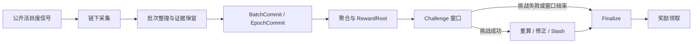
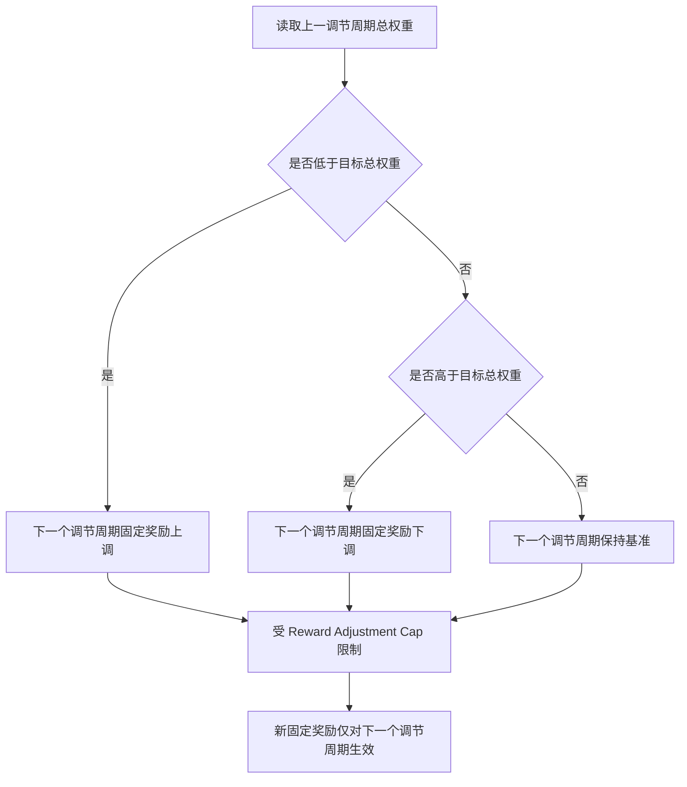

# Proof of Live Engagement（PoLE）白皮书

## 构建按小时向真实玩家分配奖励的游戏价值网络

**版本：** 2.1  
**发布日期：** 2026 年 4 月  
**文档状态：** 正式发布版

---

# 执行摘要

Proof of Live Engagement（PoLE）是一个面向 PC 游戏生态的专用应用型网络。PoLE 关注的核心不是把游戏资产搬上链，也不是把所有原始数据都写上链，而是把“某个小时里，谁真实参与了游戏、参与了多久、参与的是哪类游戏”转化为可验证、可分配、可追溯的链上奖励结果。

PoLE 的经济单元不是单笔交易，也不是单次上报，而是 **1 小时奖励区块**。每个奖励区块开始时，协议先确定该小时的固定奖励池；在该小时内，玩家根据“有效游玩时长 × 游戏权重”形成个人权重；该小时结束后，奖励按个人权重占全网总权重的比例分配给当小时的活跃玩家。与此同时，协议会读取上一调节周期的全网总权重，对下一调节周期的固定玩家奖励做反向调节：上一调节周期总权重偏低，则下一调节周期奖励提高；上一调节周期总权重偏高，则下一调节周期奖励降低。

因此，PoLE 的核心不是“谁上传了多少数据”，而是“该小时里，谁为游戏生态贡献了多少有效参与权重”。玩家奖励是主奖励，服务奖励是为了保证这条主奖励路径能够被可信地计算、公开地复核和稳定地执行。

这一核心依赖**互证（Mutual Proof）**判定：玩家节点先声明自己游玩了多久，再由至少两个具有独立观测能力的第三方节点分别证明它确实在场；链上核对心跳覆盖、见证数量、独立观测数与观测偏离容差后才判定该会话有效。只有被判定为有效的游玩时长才形成权重，既决定玩家奖励资格，也构成发行活跃度信号的输入。由此，伪造游玩时长的成本从“单方自报”变为“需要买通多个互不相同的独立观测者”。同时，**玩家奖励的收款人就是节点自身，协议不引入独立的 `player_address`** —— 玩游戏的节点与做证明的节点本就是同一批可质押、可惩罚的主体。

PoLE 采用“链下采集与复核，链上承诺、结算与 Challenge”的最小可信结构。链下负责采集公开活跃度信号、整理批次、保留原始证据并支持复核；链上负责记录承诺、奖励根、惩罚结果与治理参数。PoLE 不承诺永久保存所有原始数据，但承诺在 Challenge 窗口内为关键证据提供可取回性与公开纠错能力。

在供给侧，PoLE 采用**无总量硬上限**的发行模型：只要存在被相互证明的真实游玩，协议就按衰减的参考曲线持续铸造，并在已确认奖励超出当期参考发行量时补铸精确短缺额。长期供给的约束不来自发行端封顶，而来自三项可实测机制 —— 单位奖励的 ±cap 平方根负反馈、单调衰减的参考发行曲线（实测 30 年发行率从 9583 bps 降至 199 bps）、以及随真实使用与惩罚行为浮动的五条销毁通道（实测 20 年销毁约占发行 999 bps）。

PoLE 的核心立场只有三条：

1. 玩家优先。新增价值优先回流真实参与游戏的玩家。
2. 规则公开。奖励公式、聚合口径、争议边界必须可复算。
3. 责任清晰。采集、保留、验证、提议等服务职责应获得补偿，但不应盖过玩家主奖励。

## 阅读指南

对于首次阅读 PoLE 白皮书的读者，建议按以下顺序理解：

1. 先读 **第三章**，理解小时奖励主线、玩家权重和跨小时调节机制。
2. 再读 **第二章**，理解链下采集、链上承诺和 Challenge 的可信结构。
3. 然后读 **第四章**，理解玩家主奖励与服务辅助奖励的经济边界。
4. 最后读 **第五章** 和 **第六章**，理解治理与信任假设。

---

# 第一章 问题陈述与设计目标

## 1.1 问题背景

PC 游戏生态中的核心价值来自真实玩家的持续参与。玩家的在线、游玩、留存、回流与社区讨论，共同构成了游戏热度与生态价值的基础。然而，在传统平台结构中，这些行为通常只被平台和发行方看见，玩家自身很难分享由自身参与创造的网络价值。

现有的 Web3 游戏尝试大多集中在两类路径：

1. 围绕游戏资产发行 NFT 或代币，把价值锚定在资产所有权上。
2. 围绕全新链游设计通胀体系，把价值锚定在项目内经济循环上。

这两条路径都没有正面回答一个更基础的问题：**如果玩家在一个已经存在的游戏生态里真实地玩了一个小时，这一小时的参与是否可以成为可验证、可分配的价值来源。**

PoLE 要解决的，就是这个问题。

## 1.2 PoLE 的设计目标

PoLE 的目标不是做一个通用智能合约平台，而是做一个围绕“真实游戏参与”设计的专用网络。V1 阶段只追求四个目标：

1. 定义清晰的小时级奖励规则。
2. 让奖励结果可以公开复算。
3. 让错误结果可以在有限窗口内被挑战和纠正。
4. 在不依赖永久归档的前提下，保持最小可信边界。

## 1.3 核心原则

PoLE 的协议与文档都围绕以下原则展开：

1. **玩家优先。** 玩家奖励是主奖励，服务奖励是辅助奖励。
2. **小时结算。** 奖励按 1 小时为最小结算单元，不做分钟级实时浮动。
3. **跨周期调节。** 下一调节周期的固定玩家奖励根据上一调节周期总权重反向调整。
4. **链下大数据，链上关键结果。** 链上不承载海量原始观测，只承载可信边界。
5. **可挑战、可纠错。** 错误聚合、错误奖励、遗漏数据和不可取回数据都必须可争议。

---

# 第二章 整体架构

## 2.1 协议总览

PoLE 采用专用应用型网络架构，围绕一个明确流程运转：

`采集 -> 批次整理 -> 链上承诺 -> 聚合 -> 奖励根生成 -> Challenge -> Finalize -> 领取`

其中：

- 链下负责采集、保留、传播和复核原始信号。
- 链上负责固化承诺、记录奖励结果、执行惩罚和治理更新。
- Epoch 负责汇总、管理 Challenge 窗口和形成最终结算边界。
- 1 小时奖励区块负责定义玩家奖励本身。

### 2.1.1 总流程图

```mermaid
flowchart LR
    A[公开活跃度信号] --> B[链下采集]
    B --> C[批次整理与证据保留]
    C --> D[BatchCommit / EpochCommit]
    D --> E[聚合与 RewardRoot]
    E --> F[Challenge 窗口]
    F -->|挑战成功| G[重算 / 修正 / Slash]
    F -->|挑战失败或窗口结束| H[Finalize]
    G --> H
    H --> I[奖励领取]
```

## 2.2 数据采集与聚合机制

PoLE 的价值基础来自 **公开可验证的游戏活跃度信号**，而不是单一平台的私有口径。V1 阶段优先支持公开数据基础更强、复核难度更低的信号来源，并允许未来在保持规则稳定的前提下扩展更多来源。

PoLE 不要求每一条观测都逐条上链确认，而采用三层结构：

1. **观测层。** 节点按统一时间粒度采集游戏活跃度信号。
2. **承诺层。** 节点将一组观测整理为批次，并生成链上承诺。
3. **复核层。** 其他参与者根据承诺和原始证据复算聚合结果与奖励结果。

这一设计的目标是：

- 避免把高体量原始数据直接塞进链上。
- 保留公开复核和公开纠错能力。
- 让任何人都能围绕同一批承诺对象发起 Challenge。

## 2.3 共识与最终性

PoLE 的共识分为两个层次：

1. **区块与状态共识。** 负责链上交易、承诺、惩罚与治理结果的确定性。
2. **数据结果共识。** 通过“承诺 + Challenge + Finalize”形成最终有效的聚合结果与奖励结果。

这意味着 PoLE 并不追求“所有观测全网逐条强共识”，而是追求“关键结果在有限窗口内可被推翻，窗口结束后明确 Final”。

对 V1 而言，以下对象应具有明确的 Challenge 与 Finalize 语义：

- `BatchCommit`
- `EpochCommit`
- `AggregateRoot`
- `RewardRoot`
- `RetentionClaim`

### 2.3.1 白皮书术语与实现对象映射

为避免概念层术语与实现层对象发生歧义，PoLE 在 V1 中采用如下映射口径：

| 白皮书术语 | V1 实现口径 | 说明 |
|---|---|---|
| `BatchCommit` | `BatchCommit` | 批次级链上承诺对象 |
| `EpochCommit` | `EpochCommit` | Epoch 级最终承诺对象，包含 accepted batches、observations、aggregates、rewards 与 availability 等 commitment |
| `AggregateRoot` | `EpochCommit.aggregates` | 聚合结果对应的 Merkle commitment |
| `RewardRoot` | `EpochCommit.rewards` | 奖励结果对应的 Merkle commitment |
| `RetentionClaim` | `ReplicaReceipt` + `AvailabilityRecord` | 对“证据在保留窗口内可取回”的责任声明与记录证明 |
| 游玩声明 | `PlaySession` | 玩家节点声明的游玩事实（时长、游戏、观测载荷） |
| 心跳 | `PlayHeartbeat` | 会话内按时间桶提交的存活证明 |
| 见证证明 | `WitnessAttestation` | 第三方节点基于自身独立观测作出的证明 |
| 会话结算 | `SessionSettlement` | 链上对会话有效性的判定与失效原因 |
| 有效会话权重 | `ValidSessionWeightUnitsForEpoch` | 仅有效会话贡献的权重，进入发行活跃度信号 |
| 见证信用 | `WitnessCreditsForEpoch` | 每个见证在 epoch 内被采纳的 attestation 数，用于切分 `verify_pool` |

在后续实现、审计与治理讨论中，若采用更细的对象命名，应以“不改变上述责任边界”为前提。

## 2.4 执行边界

PoLE V1 采用固定功能状态机。链上原生支持的核心动作包括：

- 节点注册与状态更新
- 质押与解质押
- 数据承诺提交
- Challenge 发起与裁决
- 奖励结果确认与领取
- 治理提案与投票

V1 不包含：

- 通用智能合约执行
- 跨链桥与外部映射资产
- 把 AI 或 ZK 作为正确性前提

## 2.5 数据可用性与证据保留

PoLE 明确区分三个概念：

1. **链上永久对象。** 承诺、奖励根、惩罚结果、治理结果。
2. **Challenge 窗口内必须可取回的证据。** 原始观测、批次、必要签名与保留证明。
3. **长期历史归档。** 超过保留期后仍继续保存的数据。

V1 的强保证只覆盖前两者，不覆盖第三者。也就是说，PoLE 长期保证的是：

- 规则可验证
- 结果可验证
- 在争议窗口内证据可取回

PoLE 不保证所有原始数据永久可取回。

---

# 第三章 核心机制

## 3.1 小时奖励主线

PoLE 的最小经济单元是 **1 小时奖励区块**。每个奖励区块独立结算，并遵循以下顺序：

1. 奖励区块开始时，协议确定该小时的固定奖励池。
2. 玩家在该小时内累积有效游玩时长。
3. 每位玩家按所玩游戏的权重形成个人权重。
4. 该小时结束后，所有玩家个人权重汇总为该小时全网总权重。
5. 固定奖励池按个人权重占比分配给该小时内的活跃玩家。
6. 该小时结果进入 Epoch 汇总与后续 Challenge 流程。

这条主线必须在任何实现、测试、审计和治理更新中保持不变。

## 3.2 玩家权重定义

玩家在单个奖励区块中的权重定义为：

**Player_Hour_Weight = Effective_Play_Time_In_Hour × Game_Weight**

其中：

- `Effective_Play_Time_In_Hour`：该玩家在该小时内被协议承认的有效游玩时长。
- `Game_Weight`：该游戏在协议中的权重系数。

如果一名玩家在同一小时内游玩多个游戏，则其个人权重为各游戏分项权重之和：

**Player_Total_Hour_Weight = Σ(Effective_Play_Time_i × Game_Weight_i)**

### 3.2.1 有效游玩时长的 V1 定义

“有效游玩时长”不是抽象叙事，而是必须可复算的协议输入。对 V1 而言，`Effective_Play_Time_In_Hour` 至少应满足以下约束：

1. 只统计落在当前奖励区块时间边界内的游玩秒数。
2. 只统计命中协议支持的游戏映射并通过基础信号校验的前台活跃时段。
3. 同一自然时间片不得因多开、重复上报或多源重叠而被重复累计。
4. 明显不符合活跃参与特征的空转在线、纯挂机、失焦后台悬挂时段不得计入。
5. 任何被计入的时长都必须能够在 Challenge 窗口内回溯到对应观测、批次与时间边界。

V1 不追求一次性穷尽所有“真实参与”判定技术，但必须做到：可解释、可复算、可争议、可修正。

### 3.2.2 有效游玩时长的互证口径（V1 代码口径）

V1 实现把“节点声称自己玩了”与“别的节点证明它确实玩了”绑定在同一套记录上，因此 `Effective_Play_Time_In_Hour` 不是单方自述，而是**经过他人见证与心跳覆盖约束后的时长**：

1. **游玩声明**：玩家节点提交 `PlaySession`，声明本区块内的 `play_seconds`、游戏 `app_id`、观测载荷 `observation_cid` 与观测到的玩家数。声明时长不得超过奖励区块长度（`reward_block_duration_seconds`，默认 3600 秒）。
2. **心跳覆盖**：玩家节点按 `heartbeat_bucket_seconds`（默认 300 秒）逐桶提交 `PlayHeartbeat`。心跳覆盖率 `heartbeat_coverage_bps` 必须达到 `min_heartbeat_coverage_bps`（默认 5000，即 50%），且心跳条数不得少于 `min_heartbeat_count`。缺失心跳的时段不被计入有效游玩时长。
3. **见证证明**：见证节点提交 `WitnessAttestation`，且必须满足链上独立性规则 —— 见证者不能是玩家本人，不能是该会话的采集者，必须具有自己的 `collect` 能力，且在该 epoch 拥有一条**独立的**观测记录（其 `payload_cid` 不得复用会话的 `observation_cid`）。见证者的观测玩家数与玩家声明的偏离不得超过 `min_witness_observation_tolerance_ppm`（默认 500000，即 50%）。
4. **去重口径**：采纳的见证数 `witness_count` 不得少于 `min_witness_count`（默认 2），且**不同见证指向不同观测**的条数 `distinct_observation_count` 不得少于 `min_distinct_observations`（默认 2）。多个见证递交同一份观测载荷只算一份，不因人数而放大。

结算时 `SessionSettlement` 记录该会话是否 `valid` 及失效原因。仅当会话经结算判定为有效时，其权重 `ValidSessionWeightUnitsForEpoch` 才进入全网总权重参与分账；被判定失效的会话既不产生玩家奖励，也不计入单位奖励调节的活跃度信号。

这一机制的经济含义是：单人自述无法独立构成有效游玩时长，必须由至少两个互不相同的第三方观测共同证明。由此，伪造游玩时长的成本从“零成本自报”变为“需要买通多个具有独立观测能力的节点”。

## 3.3 小时内奖励分账

单个奖励区块内，玩家奖励按以下公式分配：

**Player_Hour_Reward = Hourly_Reward_Pool × Player_Hour_Weight / Total_Hour_Weight**

其中：

- `Hourly_Reward_Pool`：该小时开始时已确定的固定奖励池。
- `Total_Hour_Weight`：该小时内全网所有活跃玩家的总权重。

这意味着：

- 玩得越久，个人权重越高。
- 游戏权重越高，个人权重越高。
- 同一小时奖励池固定，小时内不会中途变化。
- 分账只在该小时结束后进行，不在小时中途实时结算。

### 3.3.1 小时结算示例

为了帮助理解，以下给出一个简化示例。

假设某一小时的固定奖励池为 `1,000 POLE`，该小时有 3 位活跃玩家：

| 玩家 | 有效游玩时长 | 游戏权重 | 个人权重 |
|---|---:|---:|---:|
| A | 60 分钟 | 1.0 | 60 |
| B | 30 分钟 | 2.0 | 60 |
| C | 15 分钟 | 0.8 | 12 |

则该小时的全网总权重为：

**Total_Hour_Weight = 60 + 60 + 12 = 132**

相应的玩家奖励为：

- A：`1,000 × 60 / 132 ≈ 454.55`
- B：`1,000 × 60 / 132 ≈ 454.55`
- C：`1,000 × 12 / 132 ≈ 90.91`

这个例子说明两件事：

1. 更长的有效游玩时长会提高个人权重。
2. 更高的游戏权重会提高相同时长下的奖励份额。

## 3.4 跨调节周期奖励调节机制

PoLE 采用负反馈调节机制来决定 **下一个调节周期** 的固定玩家奖励额度。

基本规则是：

- 上一调节周期的全网总权重低于目标值，则下一个调节周期的固定奖励上调。
- 上一调节周期的全网总权重高于目标值，则下一个调节周期的固定奖励下调。

抽象公式如下：

**Next_Period_Player_Reward = Adjust(Base_Player_Block_Reward, Target_Network_Weight, Previous_Period_Network_Weight)**

V1 的参考实现口径允许 `Adjust(...)` 采用受上限约束的平方根负反馈函数。也就是说，协议重点约束的是“调节方向、调节边界与生效时点”，而不是唯一的函数形式。

为了避免剧烈波动，PoLE 对调整机制设置三条边界：

1. **只影响下一个调节周期。** 不追溯已经结束的奖励区块。
2. **单个调节周期内固定。** 当前调节周期开始后，不因实时参与人数变化而改变。
3. **调整幅度有上限。** 每次上调或下调都必须受 `Reward_Adjustment_Cap` 约束。

该机制的目标不是制造高波动收益，而是让网络围绕一个目标参与强度运行：

- 冷时段或低参与时，提高激励。
- 热时段或高参与时，降低单位奖励。
- 长期维持更稳定的价值分配节奏。

### 3.4.1 调节示例

假设：

- `Base_Player_Block_Reward = 1,000 POLE`
- `Target_Network_Weight = 100,000`
- 单次调整上限为 `10%`

那么：

- 如果上一调节周期总权重为 `50,000`，说明参与度低于目标值，下一个调节周期的固定玩家奖励可上调，例如调至 `1,100 POLE`
- 如果上一调节周期总权重为 `160,000`，说明参与度高于目标值，下一个调节周期的固定玩家奖励可下调，例如调至 `900 POLE`

这里的重点不是具体采用线性、开方还是其他调节函数，而是协议必须满足以下性质：

1. 调节方向明确。
2. 调节幅度受限。
3. 调节结果只对未来生效。

### 3.4.2 调节逻辑示意图

```mermaid
flowchart TD
    A[读取上一调节周期总权重] --> B{是否低于目标总权重}
    B -->|是| C[下一个调节周期固定奖励上调]
    B -->|否| D{是否高于目标总权重}
    D -->|是| E[下一个调节周期固定奖励下调]
    D -->|否| F[下一个调节周期保持基准]
    C --> G[受 Reward Adjustment Cap 限制]
    E --> G
    F --> G
    G --> H[新固定奖励仅对下一个调节周期生效]
```

## 3.5 GVS 与游戏权重

PoLE 不直接按“玩了多久”发奖励，而是按“玩了多久、玩的是哪类游戏”发奖励。因此，协议需要一套相对稳定的游戏权重来源。

PoLE 用 Game Value Score（GVS）作为游戏权重的上游指标。V1 阶段，GVS 的作用不是决定谁能参与奖励，而是决定不同游戏在同样游玩时长下的相对权重。

V1 中，GVS 应服务于三个目标：

1. 给公开数据基础更强的游戏更稳定的权重口径。
2. 给数据可信度较低的游戏更谨慎的权重上限。
3. 让权重规则可被治理更新，但不能追溯改写历史小时奖励。

抽象上，PoLE 可将 GVS 映射为 `Game_Weight`，但白皮书不强制绑定唯一公式。协议强约束的是：

- 映射规则必须公开。
- 同一时段内映射规则必须稳定。
- 历史时段的映射结果必须可追溯。

### 3.5.1 GVS 的 V1 参考计算口径

为保证外部读者可以复核经济行为，V1 建议公开以下参考口径：

1. 先从公开活跃度信号得到基础游戏活跃值 `Base_GLV`。
2. 再根据信号可信度将游戏归入 `Tier 1 / Tier 2 / Tier 3`。
3. 之后叠加时间衰减系数与覆盖奖励系数，形成 `GVS`。
4. 最后将 `GVS` 通过公开映射规则转换为 `Game_Weight`。

参考上，可写为：

**GVS = Base_GLV × Tier_Weight × Time_Decay × Coverage_Bonus**

其中：

- `Tier_Weight` 反映不同可信层级的权重上限差异。
- `Time_Decay` 反映时段内样本新鲜度差异。
- `Coverage_Bonus` 反映多采集者交叉覆盖带来的可信度提升。

V1 不要求把上述每个系数永久锁死，但要求每次变更都公开参数、公开生效边界，并且仅面向未来时段生效。

## 3.6 Tier 分层系统

PoLE 对游戏信号采用分层处理，以平衡覆盖面与可信度。

### Tier 1：公开可验证层

特点：

- 公开数据来源稳定
- 采集粒度较高
- 交叉复核成本低

这一层是 V1 的主路径。

### Tier 2：增强复核层

特点：

- 可获得多源信号
- 复核难度高于 Tier 1
- 权重与可信度应更保守

### Tier 3：社区验证层

特点：

- 原始公开信号较弱
- 更依赖多方上报与争议纠错
- 只应获得更低、且更谨慎的权重区间

Tier 的核心作用不是把游戏排除在外，而是把 **可信度差异** 体现在权重和复核要求上。

## 3.7 节点运营机制

PoLE 采用统一节点模型。所有参与者使用同一套协议与客户端，不通过割裂的软件版本划分“不同链上物种”。职责差异来自能力开关、稳定性、资源与质押要求，而不是来自不同协议。

节点职责可分为三类：

| 角色 | 主要职责 | 奖励方向 |
|---|---|---|
| 玩家节点 | 提供有效游玩信号、基础观测与最低限度网络参与 | 以玩家奖励为主 |
| 服务节点 | 承担采集、保留、复核、传播与可取回责任 | 以服务奖励为主 |
| 关键职责节点 | 承担提议、最终提交与更高责任操作 | 获得更高责任补偿，同时承担更强约束 |

### 3.7.1 互证模型下的节点双重身份（V1 代码口径）

在互证模型下，同一个节点同时承担两种角色，而这两种角色都受奖励：

1. **作为玩家**：节点提交自己的 `PlaySession` 与 `PlayHeartbeat`，在被见证且通过结算后获得玩家奖励。
2. **作为见证者**：节点对其他玩家的会话提交 `WitnessAttestation`，在被采纳后参与 `verify_pool` 的分配。

这里有一个刻意的设计选择：**玩家奖励的收款人就是节点自身，协议不引入独立的 `player_address`**。理由是，在互证模型里“玩游戏的节点”与“证明别人的节点”本就是同一批参与者，把两者拆成不同地址只会制造新的女巫攻击面与激励错配。玩家身份与节点身份的一一对应，使“玩得多”和“证得多”必须由同一个可质押、可惩罚的主体承担。

见证激励与玩家激励的比例关系必须被正视：V1 参考参数下玩家奖励占发行口径的约 80%，而见证奖励复用 `verify_reward_bps`（默认 1500 bps，即 15%）的服务辅助池、按被采纳见证数二次分配，实际发行占比仅约 1.5%。这是本模型已知的**参数敏感点**：当见证工作成为真实瓶颈时，需要通过治理上调见证相关权重，而不是靠节点自觉。

PoLE 的设计立场是：

- 玩家是网络价值的主要来源。
- 服务者是价值分配与可信边界的维护者。
- 服务奖励不应重于玩家主奖励。

## 3.8 从采集到 Challenge 的完整流程

PoLE 的 V1 流程如下：

1. 玩家节点提交游玩声明（`PlaySession`），声明本区块内的游玩时长、游戏与观测载荷；同时按心跳桶提交 `PlayHeartbeat`。
2. 见证节点基于**自己独立的观测**提交 `WitnessAttestation`，链上按独立性规则校验见证资格。
3. 结算者提交 `SettleSession`；链上核对心跳覆盖、见证数量、独立观测数、观测偏离容差，判定该会话是否有效。
4. 节点在规定时间粒度内采集活跃度信号。
5. 采集结果被整理为批次，并附带必要签名、时间边界和摘要。
6. 批次对应的 `BatchCommit` 被写入链上。
7. 复核者按确定性规则计算聚合结果与小时奖励结果，`EpochCommit` 的 `Rewards` 承诺写入链上。
8. 网络进入 Challenge 窗口。
9. 任何观察者都可以围绕错误结果发起 Challenge。
10. Challenge 成功，则重算、惩罚并修正结果。
11. Challenge 失败，则挑战保证金被扣除。
12. 窗口结束后，结果 Final，并进入领取阶段。

其中第 1 至第 3 步是互证模型新增的“游玩声明 → 见证 → 结算”环节，第 4 至第 12 步是原有的“采集 → 批次 → 承诺 → 挑战 → 领取”主干。**两者通过 `SessionSettlement` 的判定结果耦合**：只有被判定为有效的会话才产生玩家权重，而玩家权重是发行活跃度信号的输入，因此伪造游玩声明会同时影响奖励资格与全网发行曲线。

可挑战对象至少包括：

- 漏报或重复批次
- 错误聚合
- 错误奖励根
- 存储不可取回
- 明显不符合规则的时间窗或签名异常
- 虚假游玩声明与伪造见证（对应 `session_slash_bps` 与 `challenge_bond_burn_bps`）

## 3.9 惩罚与 Slash

PoLE 的惩罚机制围绕“错误结果”和“错误责任履行”设计，而不是围绕抽象声誉分数设计。

Slash 的典型触发条件包括：

- 提交明显错误的承诺结果
- 在 Challenge 窗口内无法提供承诺的证据
- 在承担关键职责时未履行最基本的可用性责任
- 发起明显恶意、重复或骚扰性的无效挑战

PoLE 的惩罚原则是：

1. 处罚必须与具体责任绑定。
2. 挑战成功与失败都必须有明确经济后果。
3. 处罚结果必须公开上链并可追溯。

---

# 第四章 代币经济模型

## 4.1 代币定位

`$POLE` 是 PoLE 网络的原生功能型资产，用于：

- 小时奖励与服务奖励的结算
- 关键职责的质押与保证关系
- 惩罚与保证金扣除
- 治理提案与投票
- 网络内基础价值转移

PoLE 不把代币设计成脱离协议用途的纯叙事符号。代币价值应来自网络内部真实发生的奖励、责任、治理与使用。

## 4.2 创世供给与长期供给边界

PoLE 不采用“绝对固定总量上限”的供给模型，而采用 **创世供给 + 长期发行 + 协议销毁** 的长期运行型货币政策。

PoLE 的创世供给定义为：

**Genesis Supply = 1,000,000,000 POLE**

这一定义表示：

1. 网络在启动时有一个明确、公开、可审计的创世供给基线。
2. 创世供给并不等于永久总量上限。
3. PoLE 允许在创世供给之后，按照公开的发行规则继续产生新增代币。
4. PoLE 也允许通过公开的销毁规则持续移除部分流通代币。

因此，PoLE 长期讨论的重点不是“绝对总量是否永远不变”，而是：

- 年度新增发行有多大；
- 协议内生销毁有多大；
- 最终净供给变化是否仍然处于可持续区间。

**发行不存在总量硬上限。** 这是 V1 的明确设计决策（D2）：只要网络中存在被相互证明的真实游玩，协议就应当具备按需铸造对应奖励的能力，包括在已确认结算超出当期参考发行量时补铸精确短缺额。提供硬上限意味着在高活跃期拒绝兑付已确认的奖励，等价于对真实贡献违约。

因此，长期供给的约束**不来自发行端的封顶**，而来自三个作用在不同时间尺度上的机制：

1. **单位奖励负反馈（分钟/小时级）**：`AdjustedHourlyReward` 按活跃度相对锚点的偏离做 ±cap 平方根调节，活跃度越高，单位权重对应的奖励越低。它调节的是“每个单位贡献值多少钱”，与发行总量无关。
2. **衰减的参考发行曲线（年/十年/世纪级）**：名义发行率每两年减半，第 4 年起进入 2% 恒定尾部。尾部绝对发行量恒定而存量持续累积，因此**发行率单调衰减**（`chain/app/supply_simulation_test.go` 实测 30 年发行率从 9583 bps 降至 199 bps）。
3. **随活跃度浮动的销毁（与发行同尺度）**：五条销毁通道随真实使用与惩罚行为增长，使净供给严格小于毛发行。仿真验证：按配置销毁率跟进 20 年，销毁量约占发行量 999 bps，净供给显著低于原始发行。

PoLE 选择这一模型，是因为游戏市场和玩家网络都具有长期性。对一个希望运行数十年的协议而言，纯固定总量模型往往会在后期面临两类问题：

1. 新增激励来源逐步枯竭，难以长期支撑玩家奖励、服务奖励和安全预算。
2. 早期分配对后期结构影响过重，导致协议很难根据长期生态变化做出温和调整。

需要正视的是，无上限发行的直接代价是通胀风险：发行随活跃度线性增长，若销毁跟不上，净供给会持续膨胀。缓解不是靠承诺，而是靠上述第 2、3 项机制的可实测性，以及第 1 项机制的参数可治理性。这是本模型最大的单点风险，验证方式见 4.4.6 与 4.8.2。

## 4.3 分配结构

PoLE 的代币分配必须体现“玩家优先”。基于这一原则，PoLE 采用如下参考分配结构：

| 分配对象 | 比例 | 数量 | 用途 |
|---|---:|---:|---|
| 玩家主奖励池 | 80% | 800,000,000 | 面向小时奖励区块逐步释放 |
| 服务辅助奖励池 | 10% | 100,000,000 | 面向采集、保留、验证、提议等职责 |
| 生态与治理国库 | 5% | 50,000,000 | 面向治理执行、安全、生态发展 |
| 核心团队 | 3% | 30,000,000 | 面向长期研发与协议推进 |
| 早期支持者 | 2% | 20,000,000 | 面向早期建设与风险承担 |

这一结构表达的是明确的协议立场：

1. 先定义当期可释放的奖励总量。
2. 再把奖励总量优先分配给小时级玩家奖励。
3. 最后从较小比例中分配必要的服务奖励、国库与早期建设额度。

无论具体比例如何治理调整，PoLE 都坚持一个方向：**玩家奖励应是主池，服务奖励应是辅池。**

### 4.3.1 解锁与流通原则

创世供给并不意味着上线即全部进入流通。PoLE 对不同部分采用不同的进入流通路径：

- **玩家主奖励池**：不预挖给任何单一主体，按奖励区块与释放曲线逐步进入流通。
- **服务辅助奖励池**：按协议职责逐步释放，不在初始阶段一次性放出。
- **生态与治理国库**：仅能通过治理程序进入支出流程。
- **核心团队与早期支持者**：需遵循锁定与分期释放安排。

PoLE 建议采用以下参考锁定方案：

| 对象 | 锁定期 | 释放方式 |
|---|---|---|
| 玩家主奖励池 | 无单独锁定 | 随奖励规则逐步释放 |
| 服务辅助奖励池 | 无单独锁定 | 随职责履行逐步释放 |
| 生态与治理国库 | 无单独锁定 | 仅按治理批准支出 |
| 核心团队 | 12 个月 | 后续 24 个月线性释放 |
| 早期支持者 | 6 个月 | 后续 12 个月线性释放 |

## 4.4 长期发行曲线设计

PoLE 采用“前高后低、最终进入低但非零尾部发行区间”的长期发行模型。其目标有三个：

1. 在冷启动阶段为真实玩家提供足够强的激励。
2. 在中期逐步降低新增供给压力，避免高通胀长期稀释。
3. 在成熟期保留低强度但持续的尾部发行，以支持数十年尺度上的网络安全、服务激励和生态弹性。

### 4.4.1 冷启动与中期衰减

PoLE 在网络早期采用“两年一档、逐级减半”的参考发行规则。设初始名义发行率为 `20%`，则第 `n` 年对应的名义发行率为：

**Annual_Emission_Rate(n) = Initial_Emission_Rate × (1/2)^floor((n - 1) / 2)**

其中：

- `Initial_Emission_Rate = 20%`
- 每 2 年进入下一档
- 每进入下一档，名义发行率减半

按该规则，参考节奏如下：

| 年份区间 | 名义发行率 |
|---|---:|
| 第 1 至第 2 年 | 20.00% |
| 第 3 至第 4 年 | 10.00% |
| 第 5 至第 6 年 | 5.00% |
| 第 7 至第 8 年 | 2.50% |
| 第 9 至第 10 年 | 1.25% |

### 4.4.2 长期尾部发行

PoLE 的规范目标是不把长期名义发行率收敛到绝对零，而是在中长期进入低强度尾部发行区间。为了与当前实现保持一致，V1 正式口径暂采用如下两层表述：

1. **当前实现口径**：延续“两年一档、逐级减半”的离散衰减曲线，由治理按需更新后续年度参数。
2. **长期目标口径**：在成熟期引入显式尾部发行地板，使长期名义发行率稳定在受治理约束的低年化区间，而不是无限趋近于零后消失。

这意味着，`0.5% - 2.0%` 的低年化尾部发行区间应被视为 **PoLE 的长期政策目标**，而不是已经在 V1 代码中永久固化的规则。

这意味着：

- PoLE 的早期发行用于冷启动；
- PoLE 的尾部发行用于长期安全和持续激励；
- PoLE 不把“多年以后零新增发行”视为必须坚持的教条。

### 4.4.3 发行曲线的含义

PoLE 的发行曲线决定的是：

- 每个时期**最多有多少新增代币可以进入奖励与治理相关口径**

发行曲线**不直接决定**：

- 某个玩家拿到多少；
- 某个服务节点拿到多少；
- 某一小时具体奖励池是多少。

这些结果仍然由小时奖励规则、服务奖励规则、销毁规则和治理参数共同决定。

### 4.4.4 长期货币政策的核心指标

PoLE 长期关注的不是单独的 `Emission`，而是：

- `Gross Emission`
- `Gross Burn`
- `Net Supply Change`

即：

**Net Supply Change = Emission - Burn**

因此，PoLE 真正要追求的是“可治理、可审计、可持续的净通胀区间”，而不是机械追求固定总量或单边通缩叙事。

### 4.4.5 活跃度挂钩发行（方案 A）

V1 正式口径在名义发行曲线之上引入**活跃度挂钩调节**：年度实际可发行量不再是名义曲线的机械执行，而是按网络真实活跃度相对锚点的偏离程度动态调整，使发行始终服务于“活跃度是价值基础”这一核心目标。

**公式：**

**Annual_Issuance(year) = Annual_Emission_Amount(year) × Activity_Factor(锚点, 实际活跃度)**

其中：

- `Annual_Emission_Amount(year)` 为名义基准发行量（`总供给 × 名义发行率`，名义曲线见 4.4.1，V1 代码自第 4 年起进入 `2%` 尾部发行）；
- `Activity_Factor = clamp(sqrt(锚点 / 实际活跃度), 1 − cap, 1 + cap)`；
- `锚点 = TargetNetworkWeightUnits`（既有治理参数，单一锚点）；
- `cap = 10%`（协议常量，年度调节上限）；
- `实际活跃度` = 最近一个已结算 epoch 的网络总权重（`TotalNetworkWeightUnits`）。

**语义：**

- 网络实际活跃度低于锚点（网络偏冷）时，`sqrt(锚点/实际)` 大于 1，年度发行上调，最高 `+10%`，用于激励活跃度补足；
- 实际活跃度高于锚点（网络过热）时，年度发行下调，最低 `-10%`，控制过热期新增供给；
- 活跃度与锚点持平或锚点/活跃度数据缺失时，因子为 1.0，发行回到名义曲线。

**链上执行（V1 代码已实现）：**

- 年度预算（名义曲线 × 活跃度因子，±10% cap）按 12 个**月度期**（每期 30 天，协议年 = 360 天）均分参考，每区块按 `年度预算 × 区块时间份额 / 360 天` 铸造进入模块奖励池；
- **年度预算是参考曲线，不是铸造硬上限。** V1 取消月度配额与剩余预算截断：`MintedThisMonth` 仅作为观测字段保留，月度期滚动只重置观测量、不门控发行。发行随已确认的活动持续进行，不存在“本月额度用尽即停发”的状态；
- **申领按需补铸。** 当已确认结算的应付奖励超出模块池余额时，链上按精确短缺额补铸后再支付，因此已确认的奖励永远可兑付，不受参考曲线进度约束；
- 每区块的追赶间隔上限为一个月：即使发生长时钟跳跃，单区块最多按一个月的份额铸造，避免时间跳跃造成的突发性铸造；
- 销毁闭环：超过 `RewardBurnThreshold` 的奖励申领超额部分按 `RewardBurnBps` 销毁，兑现 `Net Supply Change = Emission − Burn`；
- 月度期与协议年均以创世时间为起点推进，跨语言（Rust 链下计算与 Go 链上执行）以同一组 fixtures 锁定年度预算公式一致性。

**为什么取消硬上限（D2 决策依据）：**

PoLE 的奖励承诺是“无上限”的 —— 只要存在被证明的真实游玩，就应当有对应的奖励发放。若把年度/月度预算当作铸造硬上限，则高活跃期会因额度耗尽而拒绝兑付已确认的奖励，这等价于对真实贡献违约，也会把活跃度信号与奖励能力解耦。因此 V1 的选择是：**发行曲线负责单位奖励经济性，而非供给总量控制；供给总量的长期约束由销毁通道与活跃度负反馈共同承担。** 这一选择的直接代价是通胀风险，缓解手段与验证方式见 4.8 与 4.4.6。

### 4.4.6 无上限发行的长期供给验证

取消硬上限意味着“发行曲线会自然约束长期供给”这一命题必须被实测，而不能只作声明。V1 以一组长期供给仿真测试把它作为发布门禁（`chain/app/supply_simulation_test.go`）：

1. **衰减曲线的形状可验证**：逐协议年推进 20 年，每年实际铸造量必须精确等于该年参考额度，且逐年单调不增，第 4 年后进入恒定非零尾部 —— 尾部**不归零、不收口**，这正是“无上限”在代码层面的体现。
2. **通胀率单调下降**：推进 30 年，每年发行量相对于当年年初存量的比例必须严格逐年递减。尾部支付恒定而存量持续累积，所以发行率必然衰减，这是无上限模型可持续性的核心论据。
3. **销毁随活跃度跟进时净供给受控**：按配置的销毁率销毁每年发行量，验证净供给严格等于 `发行 − 销毁`、严格低于原始发行，且销毁占比不低于配置值（误差 10 bps 内）。这证明“销毁随活跃度浮动”确实是有效的自动平衡项。

仿真同时解释了一个易被误读的现象：由于协议年索引在边界区块铸造前先行推进，每个协议年的第 12 次月度铸造已按下一年的费率计息，因此**费率切换年的实际年发行量略低于其名义额度**（例如第 3 年名义 10% 对应 100,000,000，实际铸造约 93,333,329）。这是实现口径而非缺陷，尾部年份因费率恒定不受影响。任何跨语言对账与审计都必须按这一口径复算。

## 4.5 小时奖励池

PoLE 的玩家奖励围绕小时奖励池展开。

每个小时奖励区块包含两个层面的参数：

1. **该小时固定奖励池。**
2. **下一调节周期的调节基准。**

该小时固定奖励池决定当前小时如何分账；下一调节周期的调节基准决定未来固定奖励如何变化。二者不能混为一谈。

这意味着 PoLE 的奖励是“小时内静态、跨小时动态”的。

### 4.5.1 V1 参数边界

为避免“概念正确但实现边界模糊”，PoLE 建议在 V1 中把以下参数作为公开、可治理、可审计的基础参数：

| 参数 | 含义 | 约束 |
|---|---|---|
| `Reward_Block_Duration` | 奖励区块长度 | 默认 1 小时 |
| `Base_Hourly_Reward` | 基础小时奖励池 | 公开、可治理 |
| `Target_Network_Weight` | 目标全网总权重 | 公开、可治理 |
| `Reward_Adjustment_Cap` | 单次调节上限 | 必须存在，不可省略 |
| `Challenge_Window` | 争议窗口长度 | 公开、可治理 |
| `Game_Weight_Map` | 游戏权重映射规则 | 同一时段内必须稳定 |

V1 不要求这些参数一步到位地达到最优，只要求：

1. 参数名称清晰。
2. 参数作用单一。
3. 参数变更面向未来生效。
4. 参数变更不会追溯改写已 Final 的奖励结果。

## 4.6 奖励分配模型

PoLE 的奖励分配模型由两部分组成：

### 4.6.1 玩家主奖励

玩家主奖励只发给该小时内满足规则的活跃玩家。

单个玩家在某小时获得的奖励由以下因素决定：

- 有效游玩时长
- 游戏权重
- 该小时全网总权重
- 该小时固定奖励池

在概念上，PoLE 奖励的是：

**“这一小时内，对游戏生态贡献了多少有效参与权重。”**

PoLE 不奖励纯挂机时间，也不奖励与游戏参与无关的空转在线。

### 4.6.2 服务辅助奖励

服务辅助奖励面向承担采集、保留、验证、提议和安全响应的参与者。其目标只有一个：维持玩家主奖励能够被可信地计算和分发。

服务奖励应遵循三条约束：

1. 不与玩家主奖励混池叙事。
2. 不反客为主，挤压玩家主奖励。
3. 必须与明确职责和责任表现绑定。

### 4.6.3 V1 参考奖励拆分

在 V1 参考配置中，PoLE 将新增进入奖励口径的代币按照以下方向拆分：

1. **玩家主奖励优先**：占大头，用于小时奖励区块结算。
2. **服务辅助奖励从属**：占小头，用于 collect / store / verify / propose 等职责补偿。

从当前实现口径看，服务辅助奖励还会细分为多个子池，例如：

- `collect_pool`
- `store_pool`
- `verify_pool`
- `propose_pool`

这些子池的存在，是为了反映不同职责的成本差异；它们不应改变“玩家主奖励优先”的根本顺序。

### 4.6.3.1 见证奖励的二次分配（互证模型新增）

互证模型引入了一类新的服务贡献：**见证**。见证节点对其他玩家的游玩声明提交独立证明，被采纳后参与分配。由于它属于“证明玩家确实玩了”的职责，V1 把它归入既有的 `verify_pool`，而不是新开一个顶层比例：

**Witness_Reward = AllocateWitnessRewards(credits, verify_pool)**

其中：

- `credits[witness]` = 该见证在该 epoch 内**被采纳的 attestation 数**（`WitnessCreditsForEpoch`）；
- 分配按 credit 按比例进行，且**精确耗尽** `verify_pool`：分数余数用最大余数法补齐，并以地址字典序作为确定性 tie-break，使任何节点从同一 credits 复算都能得到逐分不差的同一结果（共识关键要求）；
- 退化输入（池为 0、credits 为空或全零）各自返回 0，不产生空分配。

这一设计有两个刻意的取舍：

1. **复用 `verify_reward_bps`（默认 1500 bps，15%）而非新开比例**，因此在 V1 参考参数下见证奖励的实际发行占比仅约 1.5%（15% 的服务池 × 10% 的服务分配）。这是已知的参数敏感点：当见证成为真实瓶颈时应通过治理上调，而不是依赖节点自觉。
2. **只有真正排布出见证的节点才得分**：见证信用为 0 的节点（即使具备 `verify` 能力）在该 epoch 分配中得 0，不参与稀释，避免“注册即分钱”。

玩家奖励的收款人保持为节点自身，不引入独立的 `player_address`：在互证模型中“玩游戏的节点”与“证明别人的节点”是同一批主体，拆分地址只会制造新的女巫攻击面与激励错配。

### 4.6.4 奖励顺序原则

PoLE 在叙事和实现上都应保持同一个顺序：

1. 先确定该小时应发给玩家的主奖励池。
2. 再根据当小时玩家权重完成分账。
3. 最后再结算独立的服务辅助奖励。

这个顺序不能被颠倒。否则，PoLE 容易滑回“服务节点主导、玩家只是数据来源”的旧结构，而这与协议的根本定位相冲突。

## 4.7 初始流通、长期流通与国库边界

PoLE 在正式上线时，不应把全部分配额度一次性投入流通。正式发布版建议坚持以下原则：

1. 初始流通只保留满足基础流动性、协议运转和治理启动所需的最小规模。
2. 玩家主奖励池与服务辅助奖励池按规则逐步释放，而不是一次性发放。
3. 国库资金必须通过治理支出，不得作为不透明储备。
4. 团队与早期支持者的额度必须受锁定和线性释放约束。

PoLE 讨论“供给”时，重点应始终是：

- 流通量如何进入市场
- 流通量如何回流玩家
- 流通量如何被网络使用和惩罚机制吸收
- 流通量如何在长期发行与长期销毁之间保持平衡

而不是简单追求更高的名义发行量，或简单坚持绝对固定总量。

## 4.8 燃烧与费用

PoLE 的燃烧机制主要服务于三个目标：

1. 让真实使用形成价值捕获。
2. 让恶意行为承担永久成本。
3. 抑制长期净流通压力。

燃烧来源可以包括：

- 基础手续费
- 无效挑战或恶意行为的保证金扣除
- 严重违规行为带来的惩罚性销毁

PoLE 不追求为了叙事而构造激进通缩，而强调：

- 来源清晰
- 规则透明
- 可审计

### 4.8.1 参考燃烧路径

PoLE 的燃烧路径来自五类来源（V1 代码已全部接线）：

1. **基础手续费燃烧**（`fee_burn_bps`，默认 2500）：网络使用越真实，燃烧越稳定。链上在 ante 阶段先按 SDK 原生流程把手续费收进 `fee_collector` 模块账户，再按该参数从收集器余额销毁对应份额。
2. **奖励相关燃烧**（`reward_burn_bps`，默认 1000；阈值 `reward_burn_threshold`，默认 10000）：奖励申领金额超过阈值时，超额部分按该比例销毁。
3. **治理惩罚燃烧**（`governance_burn_bps`，默认 100）：挑战裁决中实际生效的罚没金额按该比例额外销毁。
4. **挑战保证金燃烧**（`challenge_bond_burn_bps`，默认 2500）：挑战被裁定为失败时，其托管保证金按该比例销毁，余数留入奖励池。
5. **虚假游玩惩罚燃烧**（`session_slash_bps`，默认 5000）：挑战类型为「错误奖励」时，对涉事玩家的 `PlayerReward`（以 `NetReward` 为上限）按该比例追加销毁。

全部五条通道均由 `chain/x/pole/keeper/burn.go` 实现，且**一律按模块余额有界**：余额不足时只销毁实际可销毁量，不会因销毁失败而阻断支付或裁决流程。这是刻意的健壮性选择 —— 销毁是经济调节项，不应成为可用性风险。

### 4.8.1.1 销毁路径与责任绑定

五条通道分别对应不同的责任来源，这一点比参数本身更重要：

| 通道 | 责任来源 | 触发条件 |
|---|---|---|
| `fee_burn_bps` | 网络使用 | 每笔交易的手续费 |
| `reward_burn_bps` | 奖励规模 | 单次申领超过阈值 |
| `governance_burn_bps` | 治理裁决 | 罚没实际生效 |
| `challenge_bond_burn_bps` | 错误挑战 | 挑战被裁定失败 |
| `session_slash_bps` | 虚假游玩 | 错误奖励类挑战成立 |

前两条随真实使用与奖励规模增长，构成「活跃度越高、销毁越多」的自动平衡项；后三条与错误行为挂钩，构成「作恶有永久成本」的惩罚项。二者共同把净供给压在毛发行之下。

### 4.8.2 销毁与通胀的关系

PoLE 的销毁机制不是为了追求单边通缩叙事，而是为了与长期发行共同构成一个长期运行的净供给调节系统。

PoLE 的核心货币政策关系应表述为：

**Net Inflation = Gross Emission - Gross Burn**

这意味着：

- 当网络使用活跃、挑战处罚频繁、费用收入稳定时，净通胀会下降；
- 当网络较冷、销毁较弱时，尾部发行仍能为玩家奖励和服务安全提供底层预算；
- PoLE 的长期目标不是“永远零通胀”，而是“长期低净通胀、可持续激励、反周期调节”。

## 4.9 经济风险

PoLE 主要面临以下经济风险：

1. 奖励调节过快，导致用户预期剧烈波动。
2. 服务奖励过重，侵蚀玩家主奖励。
3. 长期尾部发行过高，导致长期净通胀失控。
4. 低活跃时期燃烧不足，净流通压力过高。
5. 权重大幅集中在少数游戏，削弱生态多样性。
6. **无上限发行的通胀风险**：这是 D2 决策的直接代价，也是本模型最大的单点风险。发行随活跃度线性增长，销毁若跟不上净供给就会失控。缓解依赖三项可实测机制（见 4.2）：单位奖励的 ±cap 负反馈、单调衰减的参考曲线（`supply_simulation_test.go` 实测 30 年发行率降至 199 bps）、随活跃度浮动的销毁（实测 20 年销毁占比约 999 bps）。
7. **见证激励可能过弱**：V1 参考参数下见证奖励实际发行占比仅约 1.5%（见 4.6.3.1）。这是已知参数敏感点，需要治理在见证成为瓶颈时上调。
8. **见证合谋**：`min_distinct_observations` 与「见证者须有自己独立观测」能防「抄同一份观测」，但防不住 N 个节点串通伪造独立观测。V1 的缓解是挑战窗口 + `session_slash_bps`，不追求彻底解决。
9. **游玩时长伪造**：节点仍可虚报 `play_seconds`。心跳覆盖（`min_heartbeat_coverage_bps`）是针对性的缓解，代价是链上写入量上升。
10. **双层奖励数学双实现**：Rust 链下计算与 Go 链上执行会让奖励公式分叉。V1 的做法是**每个新公式都配一组双侧内嵌 fixtures**（如 `emission_cross_language_test.go` 与 `src/tokenomics.rs` 共用同一组年度调节 fixture），否则会静默分叉。

PoLE 的应对方式不是把模型做得越来越复杂，而是坚持：

- 调节有 cap
- 参数可治理
- 历史不可追溯改写
- 奖励路径可复算

---

# 第五章 治理模型

## 5.1 治理范围

PoLE 的治理对象主要包括：

- 游戏权重与 Tier 规则
- 奖励调节参数
- Challenge 窗口长度
- 质押与保证金要求
- 服务奖励比例
- 费用与燃烧参数

治理的边界同样明确：

- 可以调整未来参数
- 不可以追溯改写已经 Final 的小时奖励结果和 Epoch 结果

### 5.1.1 快参数与慢参数

为了兼顾运行效率与协议稳定性，PoLE 建议将治理参数分为两类：

| 类别 | 典型参数 | 治理特征 |
|---|---|---|
| 快参数 | `Base_Hourly_Reward`、`Target_Network_Weight`、`Reward_Adjustment_Cap`、`Challenge_Window` | 可按较短治理周期调整，但仍需延迟生效 |
| 慢参数 | `Reward_Block_Duration`、核心对象定义、Tier 框架、Slash 基本规则 | 调整频率应低，需更高治理门槛与更充分公示 |

PoLE 引入这一分层，是为了避免两种错误：

1. 把所有参数都做成高频治理，导致用户预期不稳定。
2. 把所有参数都做成低频治理，导致协议无法对真实运行状态做必要修正。

## 5.2 治理流程

PoLE 采用公开提案、公开投票、延迟生效的治理流程。

基本流程：

1. 提案提出
2. 公示与讨论
3. 链上投票
4. 延迟执行
5. 在未来的明确边界生效

这套流程的目标不是追求形式复杂，而是确保：

- 谁提的
- 改了什么
- 什么时候生效
- 能否回滚

都对社区公开。

### 5.2.1 发布级治理要求

对于正式发布版白皮书，PoLE 对治理流程还有四项额外要求：

1. 任何涉及奖励口径的提案，都必须附带示例计算。
2. 任何涉及核心对象定义的提案，都必须附带迁移说明。
3. 任何涉及 Challenge 与 Slash 的提案，都必须附带风险说明。
4. 任何提案一旦通过，都只对未来奖励区块和未来 Epoch 生效。

## 5.3 治理原则

PoLE 的治理必须遵守以下原则：

1. 未来生效，不追溯历史。
2. 参数变更优先服务于更公平、更可验证、更稳定。
3. 任何重大改动都应附带明确的验证与迁移说明。

---

# 第六章 安全性与信任边界

## 6.1 威胁模型

PoLE 的主要威胁包括：

- Sybil 身份泛滥
- 伪造或重复上报活跃度信号
- 串通提交错误聚合结果
- 在 Challenge 窗口内拒绝提供证据
- 通过恶意挑战骚扰网络

## 6.2 技术安全措施

PoLE 的技术安全依赖于以下组合：

- 公开承诺对象
- 统一数据边界与时间边界
- 可复算的聚合与奖励规则
- 有限窗口内的证据可取回性
- 明确的 Challenge 和 Slash 流程

V1 可以引入额外的工程保护措施，例如：

- 加密传输
- 签名校验
- 节点状态诊断
- 代码审计
- 漏洞赏金计划

但这些工程措施是对核心可信结构的补充，不是替代。

## 6.3 经济安全机制

PoLE 的经济安全来自：

1. 关键职责需要承担保证关系。
2. 错误结果会带来明确的经济惩罚。
3. 挑战失败也会带来成本。
4. 历史结果一旦 Final，不能被治理或单一主体任意推翻。

## 6.4 信任假设与数据寿命边界

PoLE 需要明确说明：协议证明的不是“玩家主观上是否真的在享受游戏”，也不是“任何时刻都能永久取回所有原始数据”，而是：

1. 在某个 1 小时奖励窗口内，某玩家是否提供了符合协议定义的有效参与信号。
2. 这些信号是否被正确计入了该小时个人权重。
3. 该小时奖励是否按公开规则正确分账。
4. 错误结果是否可以在 Challenge 窗口内被纠正。

PoLE 的长期可信性来自：

- 规则公开
- 结果可复算
- 窗口内可挑战
- 错误可惩罚

而不是来自对永久归档的无限承诺。

---

# 第七章 路线图

## 7.1 V1

V1 的目标不是做全，而是做稳。V1 的完成标志包括：

1. 小时奖励规则稳定。
2. 下一小时调节逻辑稳定。
3. 奖励根与领取路径可复算。
4. Challenge 窗口内关键证据可取回。
5. 玩家奖励与服务奖励边界清晰。

### 7.1.1 V1 对外发布口径

PoLE V1 对外发布时，应坚持以下口径：

1. 这是一个围绕小时奖励结算构建的专用应用型网络。
2. 这是一个以玩家主奖励为核心的协议，而不是服务节点优先的资源网络。
3. 这是一个采用最小可信结构的网络，而不是永久归档一切原始数据的系统。
4. 这是一个可以扩展的平台，但 V1 的承诺边界必须小而清晰。

## 7.2 V2

V2 可逐步增强：

- 更真实的多节点网络后端
- 更强的数据可用性证明
- 更丰富的多源活跃度信号
- 更完善的治理执行与自动化

## 7.3 长期方向

PoLE 的长期方向是在不破坏 V1 基本主线的前提下，逐步扩展到：

- 更广泛的游戏平台与信号来源
- 更成熟的长期归档与索引能力
- 更强的开放接口与生态接入

但无论如何扩展，PoLE 的核心都不应改变：

**按小时把奖励优先分给当小时真实参与游戏的玩家。**

---

# 第八章 团队、合作与社区

## 8.1 团队定位

PoLE 团队的职责是：

- 推进协议实现
- 维护安全边界
- 组织测试与审计
- 推进治理与生态启动

团队不应成为协议永久中心，也不应拥有绕过链上结果改写历史状态的权限。

## 8.2 合作方向

PoLE 的合作对象可包括：

- 游戏数据与统计服务提供方
- 安全审计机构
- 节点运营者与基础设施团队
- 社区组织与研究机构

## 8.3 社区建设

PoLE 的社区建设应优先服务于三件事：

1. 让规则被理解
2. 让结果被监督
3. 让治理被参与

---

# 第九章 风险与免责声明

## 9.1 技术风险

PoLE 可能面临实现缺陷、节点故障、网络不稳定和数据源变化等技术风险。

## 9.2 市场风险

PoLE 可能面临代币价格波动、外部竞争和行业景气变化带来的市场风险。

## 9.3 协议风险

PoLE 可能面临参数设计不当、权重过度集中、奖励调节失衡和治理执行不佳等协议风险。

## 9.4 免责声明

本白皮书用于说明 PoLE 的协议目标、机制边界与路线方向，不构成投资建议，不构成收益承诺，也不构成任何法律、税务或证券意见。

PoLE 的所有前瞻性描述都可能因实现、治理、监管、市场和技术条件变化而调整。任何参与者都应基于自身判断与风险承受能力做出决策。

---

# 附录

## 附录 A：核心术语

- **PoLE（Proof of Live Engagement）**：PoLE 网络围绕真实参与信号定义的协议机制。
- **奖励区块**：PoLE 中默认长度为 1 小时的玩家奖励结算单元。
- **有效游玩时长**：在奖励区块内符合协议规则的游玩时长。
- **游戏权重**：协议赋予某个游戏的奖励权重系数。
- **小时总权重**：某个奖励区块内全网玩家权重之和。
- **Epoch**：PoLE 用于聚合、Challenge 管理与最终确认的更高层级时间单位。
- **Challenge 窗口**：允许对承诺结果与证据可取回性提出争议的有限时间窗口。
- **调节周期**：用于保持固定玩家奖励不在每个采样点抖动的更高一级奖励调整窗口；默认可以等于 1 小时，也可以由治理配置为多个奖励区块。
- **保留声明**：对证据在争议窗口内可被取回的责任承诺；V1 中由 `ReplicaReceipt` 与 `AvailabilityRecord` 共同承接。
- **互证（Mutual Proof）**：玩家声明游玩、见证节点以自己独立的观测予以证明、链上结算判定会话有效性的三方机制；这是 V1 判定「真实参与」的核心手段。
- **游玩声明（PlaySession）**：玩家节点提交的游玩事实声明，含 `play_seconds`、游戏、观测载荷与观测玩家数。
- **心跳（PlayHeartbeat）**：玩家在会话内按时间桶周期性提交的存活证明，用于阻止「只在首尾各报一次」的时长伪造。
- **见证证明（WitnessAttestation）**：第三方节点基于自身独立观测对该会话作出的证明。
- **会话结算（SessionSettlement）**：链上对会话有效性的最终判定，含是否有效及失效原因；只有有效会话的权重才参与分账。
- **有效会话权重（Valid Session Weight Units）**：经结算判定为有效的会话所贡献的权重，是活跃度挂钩发行的输入信号。

## 附录 B：核心公式

**Player_Hour_Weight = Effective_Play_Time_In_Hour × Game_Weight**

**Player_Hour_Reward = Hourly_Reward_Pool × Player_Hour_Weight / Total_Hour_Weight**

**Next_Period_Player_Reward = Adjust(Base_Player_Block_Reward, Target_Network_Weight, Previous_Period_Network_Weight)**

**Annual_Issuance(year) = Annual_Emission_Amount(year) × clamp(sqrt(Target_Network_Weight / Previous_Epoch_Weight), 1 − cap, 1 + cap)**

**Witness_Reward = AllocateWitnessRewards(credits, verify_pool)**（按被采纳见证数精确切分，余数最大余数法补齐，地址字典序 tie-break）

**Net Supply Change = Gross Emission − Gross Burn**

## 附录 C：V1 一句话定义

PoLE 是一个以 1 小时奖励区块为核心记账单位、按有效游玩时长和游戏权重向当小时活跃玩家分配奖励、由第三方节点对游玩事实做互证、并按上一调节周期总权重调节下一调节周期固定玩家奖励的专用应用型网络；其发行随被证明的真实活跃度增长且不设总量硬上限，长期供给由衰减的参考曲线、随活跃度浮动的销毁与单位奖励负反馈共同约束。

---

**文档结束**  
*本白皮书最后更新于 2026 年 10 月 2 日*
